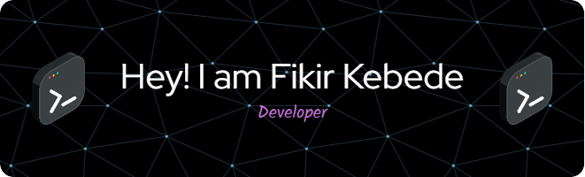

- 😄 Hi there! I'm Fikir Kebede, web developer and information system student with a passion for learning and improving my skills. I'm currently studying at Addis Ababa University. 
- ⚡ I'm a fast learner and love tackling new challenges, and I'm always looking for ways to improve and grow as a developer.
- 💬 If you're interested in collaborating or just want to chat about programming, don't hesitate to reach out!

### Languages and Tools I can work with:

 
 
 
 
 
 

 

Connect with me
  

 

  
  
   
 
